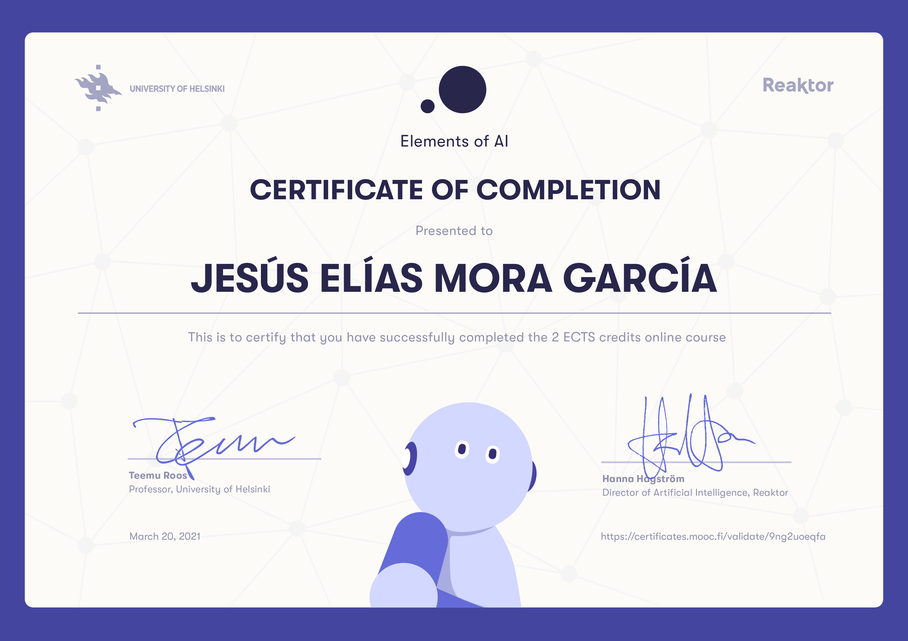

# Elements-of-AI-Introduction-to-AI-Reaktor
An Introduction to AI is a free online course for everyone interested in learning what AI is, what is possible (and not possible) with AI, and how it affects our lives – with no complicated math or programming required.

Capturing responses as a targeting objective

Written answer file

Page Course: https://www.elementsofai.com/

